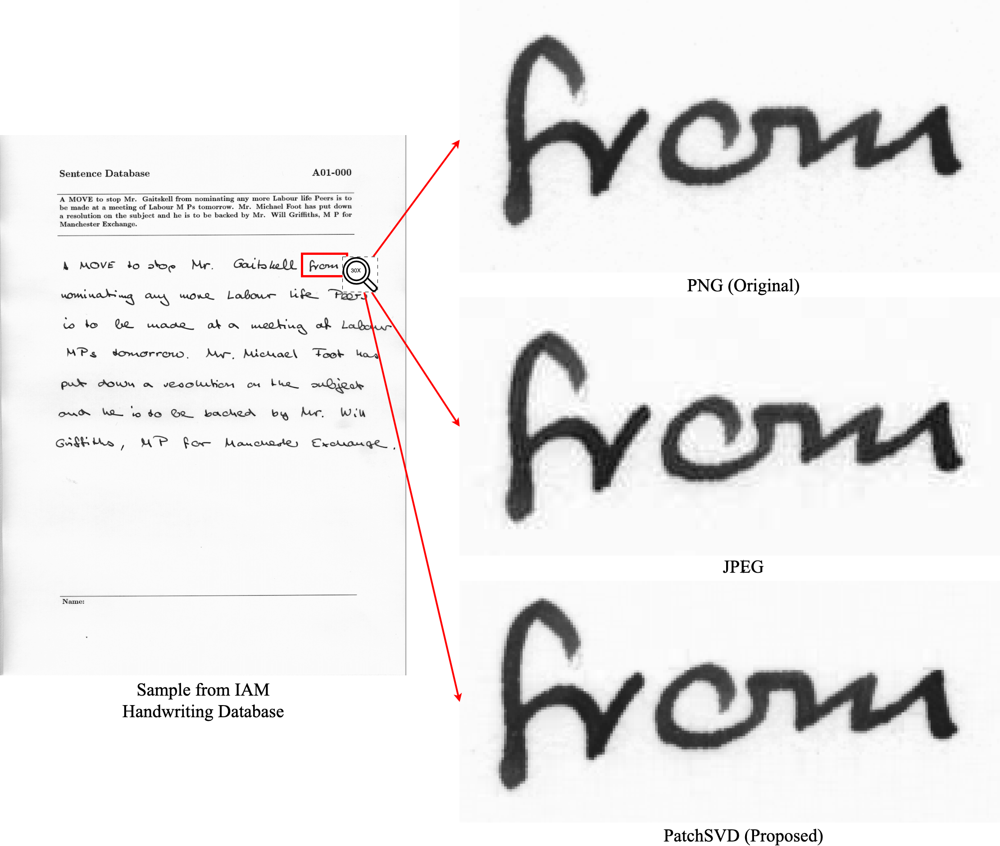

# PatchSVD
This repository includes code for the PatchSVD algorithm introduced in **PatchSVD: A Non-uniform SVD-based Image Compression Algorithm**.
PatchSVD is a simple image compression algorithm that improves SVD-based image compression by applying non-uniform compression to different patches in the input image utilizing 1-rank SVD heuristics. When we need to compress images that contain sharp changes in pixel intensity, such as compressing images that contain text, PatchSVD outperforms JPEG.



## Getting Started

After creating your virtual environment, install the dependencies by running the following command:

```
pip install -r requirements.txt
```

Then, you can compress any image:

```
cd patchsvd
python compression_experiments.py --img-path $IMAGE_PATH --p_x $p_x --p_y $p_y --target-compression $CR --output-dir $output_dir
```

If you wish to save the PatchSVD visualizations that shows the complex and simple patches, pass the `--visualize` flag to the above command. You can set a visualization limit to only save the first few visualizations by setting `--visualization_limit $limit`.

You can run PatchSVD on a dataset by passing `--dataset $dataset_name` instead of `--img-path` as follows:
```
cd patchsvd
python compression_experiments.py --dataset $dataset_name --p_x $p_x --p_y $p_y --target-compression $CR --output-dir $output_dir
```
Currently, the supported datasets are `MNIST, CIFAR-10, FGVC_Aircraft, EuroSAT, Kodak, and CLIC`; but you can add support for any dataset you wish following the examples in `compression_experiments`.

## Saved Outputs

When you run `compression_experiments.py`, a csv file will be generated as well as a folder that contains image outputs. The csv file contains the calculated metrics that can be used later for plotting.

## Visualizations

This repository includes code that visualizes how PatchSVD patches are categorized, as well as code that creates the plots that compares PatchSVD with SVD and JPEG. All the comparison plots are illustrated in the paper.

## License

[](https://creativecommons.org/licenses/by-nc/4.0/)


## Citations

Please cite the following paper if you used PatchSVD in your work:

```
Golpayegani, Z., & Bouguila, N. (2024).
"PatchSVD: A Non-uniform SVD-based Image Compression Algorithm."
In Proceedings of the International Conference on Pattern Recognition Applications and Methods (ICPRAM).
```

